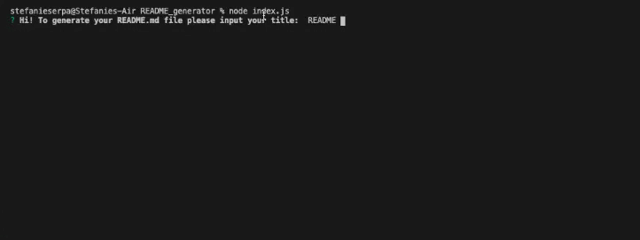

#  README Generator

## Description

A simple README generator designed for developers to quickly draft a MarkDown README file based on user input. This is a command-line application uses the [Inquirer Package](https://www.npmjs.com/package/inquirer) to gather user data and produce a quality README.
    
## Table of Contents

    1. Installation
    2. Usage
    3. License
    4. Contributions
    5. Tests
    6. Questions
    
## Installation

Run this command to install the application dependencies:
```
npm install
```

## Usage

Start app by running:
```
"node index.js"
```

## Views

Demonstration of inquirer prompts


Link to walkthrough video

[CLI Video Guide](https://drive.google.com/file/d/1JKxg3aZQCKVnf7Bm5MmdXIiB9LvCiIqi/view)

## License

The MIT License


## Contributing

Stefanie Serpa
    
## Questions
    
GitHub: [smserpa](https://github.com/smserpa)